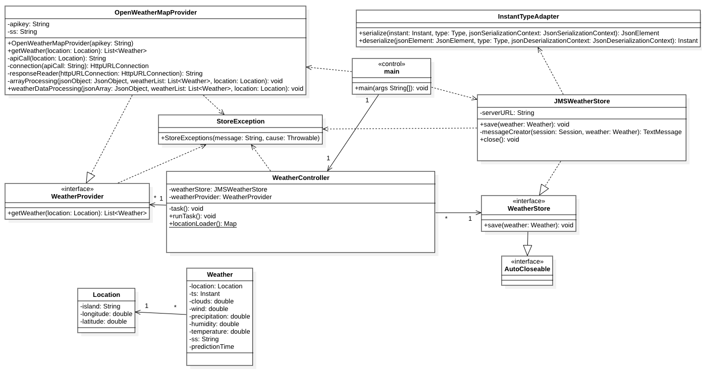
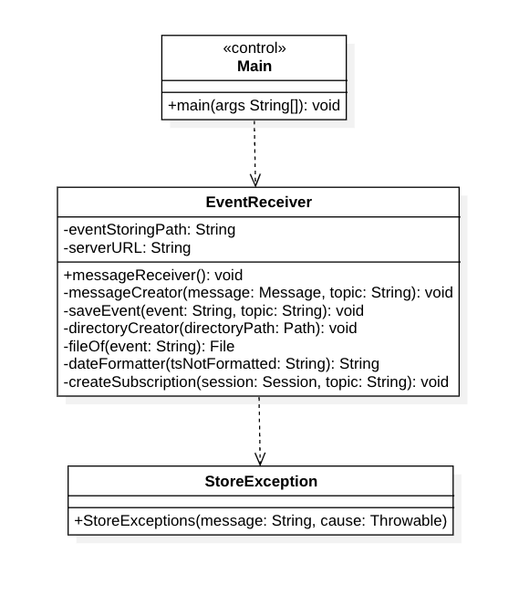
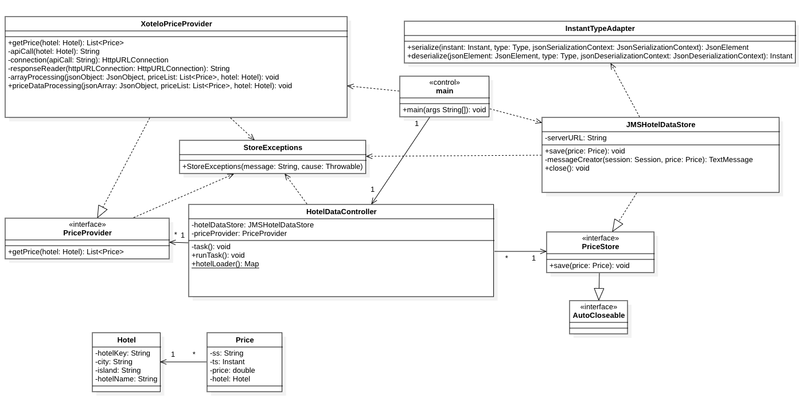

# Final Project
- **Name**: Elisa-Marie Breeze Rebstock
- **Subject**: Desarrollo de Aplicaciones para Ciencia de Datos
- **Course**: 2nd Course 2023-2024, group 43
- **Degree**: Ciencia e Ingeniería de Datos
- **School**: Escuela de Ingeniería Informática
- **University**: Universidad de Las Palmas de Gran Canaria

## Summary of Functionality

The main idea of the first practice was to take data from a public and free API REST, which in this case is https://openweathermap.org/api. This service provides a free plan with 1000 daily requests for current, historical and future weather data predictions.

In the second practice, the objective is to create a Java application that queries the service API periodically every 6 hours to obtain the weather forecast predictions for the next 5 days at 12am for each of the 8 Canary Islands, and to communicate these predictions between two modules, which are called prediction-provider and event-store-builder, but in the final project this last modules named was changed to datalake-builder.

The prediction-provider module takes the data from the OpenWeatherMapAPI, and sends it as an event to a message broker using the Java Message Service.
On the other hand, the event-store-builder module listens to the message broker, collects the data and saves them in separate files, named by the query date.

In the final project, the idea was to incorporate a business idea, which meant to include another api and analyze and expose the data of the moment to the client. In this case Xotelo was used to provide information about hotel prices periodically every 6 hours to obtain the price for the next 5 days, so that in coincides with the weather prediction time frame.
The weather and hotel information are sent to the broker and then the datalake-builder recollects the information and saves it to a file, and a new module was added for the business unit.
This new module recollects the information of the weather predictions and the hotel information and processes them to be used. Once the information is processed, it is saves in a database using SQLite, by combining the corresponding weather predictions for the location for each hotel. 
At the same time the data is going to be analyzed, and it is going to calculate the best options depending on the price, the weather or overall. These options will then be incorporated in a new table in a database and once this is done, a displayer class has been created to display the information to the client. 
The client is going to be able to choose in a few options for example if they want to see the general available hotels with their information, then choose a hotel; or look at the options and then choose the option they desire. 

## Resources Used
### Development Environments
For this project I have used the IntelliJ IDEA Integrated Development Environment (Community Edition), developed by JetBrains, including Java code (version 17) for all the functionalities exposed above. The code also uses libraries like Gson for JSON processing and ActiveMQ for the message broker, and SQLite for Database creation.
### Version Control Tools
For version control, mainly Git was used for tracking changes and saving the versions created during the development.
### Documentation Tools
The main documentation tool used in this project is Markdown, which is a lightweight markup language that is easy to read and write, and to create the class diagram, StarUML was used.

## Design

### Design patterns
In this project, there are two obvious design patterns in the different modules: 
- The class WeatherController, HotelDataController and EventController, follow a pattern called Dependency Injection, because it receives instances through their constructors, like for example the WeatherController class receives them from the classes WeatherProvider and JMSWeatherStore. 
- The use of the Timer in the runTask method in the WeatherController and HotelDataController classes, could be viewed as an Observer Pattern, as it schedules a task observed periodically at fixed time intervals.

### Design principles
They are important, because they provide guidelines for the creation of a maintainable, robust and scalable program, and increase the quality of it. This project includes some SOLID principles, like for example:
- Single responsibility Principle: The class Location in the prediction provider module and the class Hotel in the price-provider module have a single responsibility, which is the representation of the location and hotel information; The class Weather in the prediction-provider module and the class Price in the price-provider module represent the weather and price data information that can be represented
- Open-Closed Principle: This principle says that the program is open for extension but closed for modification, which means that you can add new functions without changing the code that is there already, which is used in the WeatherProvider and WeatherStore classes, and in other modules aswell like for example in price-provider the PriceStore and PriceProvider classes or in the business Unit the EventStore class, and changes can be done by adding interfaces. Apart from these two classes, the WeatherController, HotelDataController and the EventController classes can also be extended without changing its code
- Liskov Substitution Principle: Both interfaces WeatherProvider and WeatherStore can be substituted without affecting or breaking the programs code, aswell as the interfaces in the other modules
- Interface Segregation principle: Both interfaces WeatherProvider and WeatherStore provide specific methods related to their responsibilities, aswell as the interfaces in the other modules
- Dependency Inversion principle: The class WeatherController depends on both WeatherProvider and WeatherStore interfaces, providing modularity and flexibility, as well as the other controller classes in the other modules of the project, which all have a similar structure

### Class Diagram
The class Diagrams for this project are shown below:

prediction-provider module class diagram:

datalake-builder module class diagram:

price-provider module class diagram:

hotel-advisor-business-unit module class diagram:

### Dependency Relationships
Dependency Relationships refers to the connections between classes and its components. There are a few cases of these relationships which have been used: 
- The class WeatherProvider and JMSWeatherStore are independent, but are used together in WeatherController, who depends on both of these interfaces, which allows for more flexibility and a more modular design. This is also the case in the price-provider module in the HotelDataController class, which uses the independend classes PriceProvider and JMSHotelDataStore together, and in the business unit module there is a similar case with the EventController and the classes used in it
- JMSWeatherStore uses OpenWeatherMapProvider to get the data; JMSHotelDataStore uses XoteloPriceProvider to get the data
- In the module prediction-provider, the class OpenWeatherMapProvider implements the WeatherProvider interface; In the Module price-provider, the class XoteloPriceProvider implements the PriceProvider interface; In the business Unit module, the SQLiteDataStoreManager uses implements the EventStore interface
- In the class WeatherController, there is a dependency with both WeatherProvider and WeatherStore. In the other modules there are also similar dependencies in the Controller classes.
- The storing classes in both price and prediction providers have a dependency on the class InstantTypeAdapter, used to serialize in this case
- In the prediction-provider module, the classes JMSWeatherStore, OpenWeatherMapProvider, WeatherController, WeatherProvider and WeatherStore depend on the StoreException class to manage the exceptions
- In the price-provider module, the classes JMSHotelDataStore, XoteloPriceProvider, HotelDataController, PriceProvider and PriceStore depend on the StoreException class to manage the exceptions
- In the event-store-builder module, WeatherEventReceiver depends on StoreExceptions to manage the exceptions
- In the hotel-advisor-business-unit module, the classes EventAnalyzer, EventController, EventReceiver, InformationDisplayer and SQLDataStoreManager depend on the StoreException class to manage the exceptions

## Usage Instructions
This program uses the java version 17. To run the code properly, you must insert your apikey through arguments in the Main class of prediction-provider and set up ActiveMQ as the message broker. In the datalake-builder, you must insert the root directory of the datalake in the arguments as well.
It is important to know at this point that the Xotelo API provides data slowly and might take a while, so a bit of patience is requiered, but once the data has arrived, it will be analyzed, saved and exposed to the client. 
To ensure all the data has arrived and to analyze all the data at the same time, I have incorporated two CountDownLatches, which initial number is going to be the amount of hotel and weather data expected, and will count down every time one arrived. Once it gets to zero, it will start processing and analyzing the data.
With this, the only thing left to do is to run the program (first the datalake-builder and hotel-advisor-business-unit, then the prediction and price provider) and see how the weather and price data is saved in the directory, with the query date as its file name.
It is important to know that this program is designed to run the task every 6 hours, storing the data in the files created in the directory.
At the same time, the data will be recollected by the business unit, and once the data that is wanted for the client is ready, it's saved to the Datamart, and the information is shown to the client, by asking what type of information they are looking for and showing the wanted options. 
