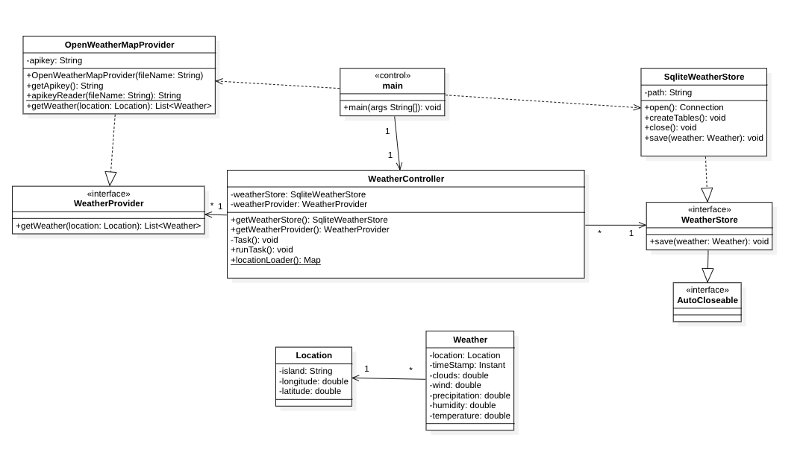

# Practice 2 - Incorporation of Data into the System Architecture
- **Name**: Elisa-Marie Breeze Rebstock
- **Subject**: Desarrollo de Aplicaciones para Ciencia de Datos
- **Course**: 2nd Course 2023-2024, group 43
- **Degree**: Ciencia e Ingeniería de Datos
- **School**: Escuela de Ingeniería Informática
- **University**: Universidad de Las Palmas de Gran Canaria

## Summary of Functionality

The main idea of the first project was to take data from a public and free API REST, which in this case is https://openweathermap.org/api. This service provides a free plan with 1000 daily requests for current, historical and future weather data predictions.

The objective is to create a Java application that queries the service API periodically every 6 hours during 5 days to obtain the weather forecast predictions for the next 5 days at 12am for each of the 8 Canary Islands, and to communicate these predictions between two modules, which are called prediction-provider and event-store-builder.

The prediction-provider module takes the data from the OpenWeatherMapAPI, and sends it as an event to a message broker using the Java Message Service.
On the other hand, the event-store-builder module listens to the message broker, collects the data and saves them in separate files, named by the query date.

## Resources Used
### Development Environments
For this project I have used the IntelliJ IDEA Integrated Development Environment (Community Edition), developed by JetBrains, including Java code (version 17) for all the functionalities exposed above. The code also uses libraries like Gson for JSON processing and ActiveMQ for the message broker.
### Version Control Tools
For version control, mainly Git was used for tracking changes and saving the versions created during the development.
### Documentation Tools
The main documentation tool used in this project is Markdown, which is a lightweight markup language that is easy to read and write, and to create the class diagram, StarUML was used.

## Design

### Design patterns
In this project, there are two obvious design patterns: 
- The class WeatherController follows a pattern called Dependency Injection, because it receives instances of the classes WeatherProvider and JMSWeatherStore through their constructors
- The use of the Timer in the runTask method in the WeatherController class, could be viewed as an Observer Pattern, as it schedules a task observed periodically at fixed time intervals.

### Design principles
They are important, because they provide guidelines for the creation of a maintainable, robust and scalable program, and increase the quality of it. This project includes some SOLID principles, like for example:
- Single responsibility Principle: The class Location has a single responsibility, which is the representation of the location information; The class Weather represents the weather data information that can be represented
- Open-Closed Principle: This principle says that the program is open for extension but closed for modification, which means that you can add new functions without changing the code that is there already, which is used in the WeatherProvider and WeatherStore classes, and changes can be done by adding interfaces. Apart from these two classes, the WeatherController class can also be extended without changing its code
- Liskov Substitution Principle: Both interfaces WeatherProvider and WeatherStore can be substituted without affecting or breaking the programs code
- Interface Segregation principle: Both interfaces WeatherProvider and WeatherStore provide specific methods related to their responsibilities
- Dependency Inversion principle: The class WeatherController depends on both WeatherProvider and WeatherStore interfaces, providing modularity and flexibility

### Class Diagram
The class Diagram for this project is shown below:

### Dependency Relationships
Dependency Relationships refers to the connections between classes and its components. There are a few cases of these relationships which have been used: 
- The class WeatherProvider and JMSWeatherStore are independent, but are used together in WeatherController, who depends on both of these interfaces, which allows for more flexibility and a more modular design
- JMSWeatherStore uses OpenWeatherMapProvider to get the data
- The class OpenWeatherMapProvider implements the WeatherProvider interface
- In the class WeatherController, there is a dependency with both WeatherProvider and WeatherStore
- The module event-store-builder has the prediction-provider module as a dependency, to be able to use the StoreExceptions Class
## Usage Instructions
This program uses the java version 17. To run the code properly, you must insert your apikey through arguments in the Main class and set up ActiveMQ as the message broker.
With this, the only thing left to do is to run the program and see how the weather data is saved in the specified directory, with the query date as its file name.
It is important to know that this program is designed to run the task every 6 hours during 5 days, storing the data in the files created in the chosen directory.

